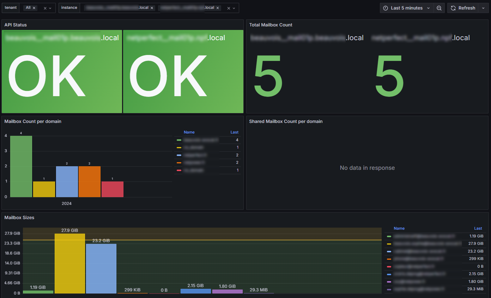
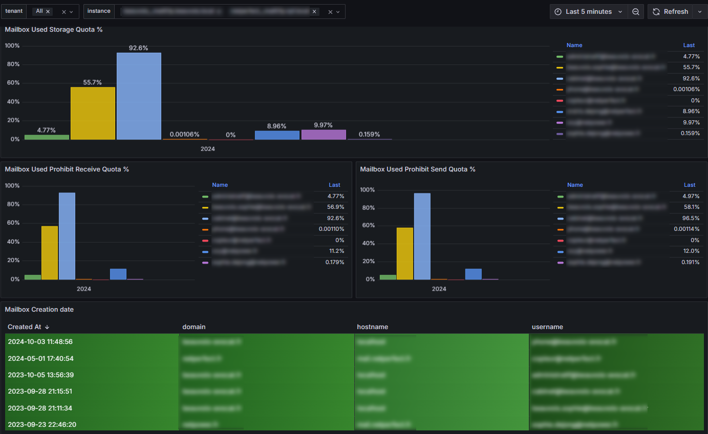

# Grommunio exporter for Prometheus
[](https://opensource.org/licenses/GPL-3.0)
[](http://isitmaintained.com/project/netinvent/grommunio_exporter "Percentage of issues still open")
[](https://github.com/netinvent/grommunio_exporter/releases/latest)
[](https://github.com/netinvent/grommunio_exporter/actions/workflows/pylint-linux.yaml)


This program exposes Grommunio email system metrics for Prometheus  
Since we already have node_exporter for system metrics and postfix_exporter for email deliverability metrics, this closes the gap with mailbox metrics.

### Requirements

- Grommunio 2.x
- python >= 3.7


### Grafana Dashboard

You can find an [example dashboard](examples/grafana_dashboard_v0.2.1.json) in the examples directory




### Automatic installation

On current Grommunio appliances based on OpenSuSE, you can use the following all-in-one installer script
```
curl -sSfL https://raw.githubusercontent.com/netinvent/grommunio_exporter/refs/heads/main/install.sh | sh -
```

### Manual Install

Easiest way to install grommunio_exporter is to use python pip:
```
python3 -m pip install grommunio_exporter
```

### Upgrading

Upgrading can be done via following command lines
```
python3 -m pip install --upgrade grommunio_exporter
systemctl restart grommunio_exporter
```

#### Special notes for Grommunio appliances
Note that on Grommunio appliances based on OpenSuSE 15.6, there may be both python 3.6 and python 3.11 installed.  
Best way not to mess with python's grommunio environment is to build a venv environment specific to a newer python version.
```
zypper install python311
python3.11 -m venv /usr/local/grommunio_exporter_venv
/usr/local/grommunio_exporter_venv/bin/python -m pip install --upgrade pip setuptools wheel
/usr/local/grommunio_exporter_venv/bin/python -m pip install grommunio_exporter
```

Running the exporter can be done via `/usr/local/grommunio_exporter_venv/bin/grommunio_exporter`. This file can be run manually for testing purposes, or run as service.

Once installed, you can create a systemd service file from the [systemd unit file](examples/grommunio_exporter.service) in the example dir.  
Once the service is running, you may query the exporter with:
```
curl http://localhost:9769/metrics
```

### Firewall

The default exporter-port is 9799/tcp, which you can change in the config file.
Keep in mind that you need to create a firewall rule if you want to query it's output.

You can create the firewall rule with the following command on a Grommunio appliance
```
firewall-cmd --add-port=9799/tcp --permanent && firewall-cmd --reload
```

### Metrics

The exporter currently produces the following metrics:  

- `grommunio_api_status` is 0 when no errors where found in api calls
- `grommunio_exporter_version` is 0 when version successfully reported
- `grommunio_gromox_version` is 0 when version successfully reported
- `grommunio_admin_version` is 0 when version successfully reported
- `grommunio_mailbox_count`
- `grommunio_shared_mailbox_count`

The following metrics are per user and have labels `hostname,domain,username`:

- `grommunio_mailbox_messagesize`
- `grommunio_mailbox_storage_quota_limit`
- `grommunio_mailbox_prohibit_receive_limit`
- `grommunio_mailbox_prohibit_send_quota`
- `grommunio_mailbox_creation_time`
- `grommunio_mailbox_out_of_office_state`


### Alert rules:

```
    - alert: Storage Quota
      expr: (1-((grommunio_mailbox_storage_quota_limit - grommunio_mailbox_messagesize)/grommunio_mailbox_storage_quota_limit))*100 > 95
      for: 5m

    - alert: Prohibit Send Quota
      expr: (1-((grommunio_mailbox_prohibit_send_quota - grommunio_mailbox_messagesize)/grommunio_mailbox_prohibit_send_quota))*100 > 95
      for: 5m

    - alert: Prohibit Receive Quota
      expr:  (1-((grommunio_mailbox_prohibit_receive_limit - grommunio_mailbox_messagesize)/grommunio_mailbox_prohibit_receive_limit))*100 > 95
      for: 5m
```

### Customization

You may create a `grommunio_exporter.yaml` that can be added to the exporter via `--config-file=/etc/grommunio_exporter.yaml` argument.  
This file can override the following:
- http listen ip
- http listen port
- http authentication
- grommunio hostname
- mysql database settings

### Troubleshooting

This program has currently been tested on grommunio-admin-api-1.16.8.

By default, the exporter will log to `/var/log/grommunio_exporter.log`  
You can override this in the config file.

You may also run the exporter with `--debug` in order to gain more information.

You can set the following scrape settings in the prometheus job:
```
scrape_interval: 300s
scrape_timeout: 240s
```

### Misc

This version of the grommunio exporter uses the locally installed grommunio-admin cli interface instead of the REST API.  
Pros:
- No need for authentication

Cons:
- Not all commands output parseable json
- Probably slower than REST UI

If the project gains some traction, we can add REST UI support.

### License

Licensed under GPLv3.0... Contributions are welcome  
(C) 2024-2025 NetInvent SASU  
