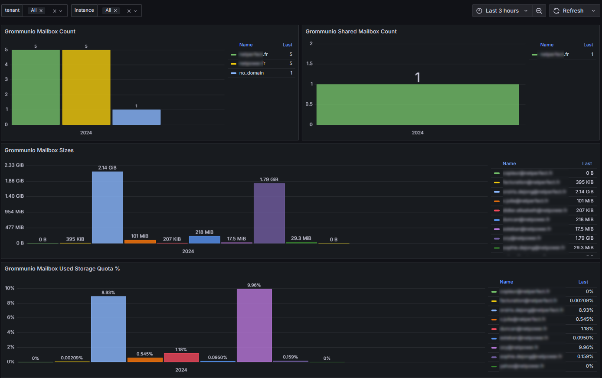

# Grommunio exporter for Prometheus
[](https://opensource.org/licenses/GPL-3.0)
[](http://isitmaintained.com/project/netinvent/grommunio_exporter "Percentage of issues still open")
[](https://github.com/netinvent/grommunio_exporter/releases/latest)
[](https://github.com/netinvent/grommunio_exporter/actions/workflows/pylint-linux.yaml)


This program exposes Grommunio email system metrics for Prometheus 

### Grafana Dashboard

You can find an example dashboard in the examples directory



### Install

Easiest way to install grommunio_exporter is to use python pip:
```
python3 -m pip install grommunio_exporter
```

The exporter needs to be installed on the host that has grommunio-admin cli interface.  
Once setup, create the file `/etc/grommunio_exporter.yaml` according to 

Extract the zip file to let's say `C:\grommunio_exporter`  
In the directory, you'll find the binaries. Grab yourself a copy of `grommunio_exporter.yaml` found in this repository and copy it into the same directory.  
Unless you want to change the grommunio_exporter password regulary, you should create a service account (local admin) which you will use to connect to grommunio console, and use for the exporter.   

Configure your local/domain administrator account according to your needs. Don't worry, once running, the user and password will be encrypted.  

Also, configure if you want to include non scheduled and/or unconfigured VMs in your metrics.  
By default, we include them since it makes sense to have too much information.  
Nevertheless, on a lot of backup policies, they should be excluded in order to avoid false positives.  

Once you're done, create a Windows Service with the following commands in an elevated command line prompt:

```
sc create grommunio_exporter DisplayName= "HornetSecurity grommunio API exporter for Prometheus" start= auto binpath= "c:\grommunio_exporter\grommunio_exporter-x64.exe -c c:\grommunio_exporter\grommunio_exporter.yaml"
sc Description grommunio_exporter "grommunio API exporter service by NetInvent"
```

Launch the service:
```
sc start grommunio_exporter
```

You should now have a running Windows Service as seen in `services.msc`:


You must also enable the grommunio REST API service with the following command:
```
sc config Hornetsecurity.VMBackup.Rest start= auto
sc start Hornetsecurity.VMBackup.Rest
```

You can now query the exporter with:
```
curl http://localhost:9769/metrics
```

### Firewall

The default exporter-port is 9769/tcp, which you can change in the config file.
Keep in mind that you need to create a firewall rule if you want to query it's output.

You can create the firewall rule with the following command:
```
netsh advfirewall firewall add rule name="Hornet Security / grommunio exporter" protocol=TCP dir=in localport=9769 action=allow
```

### Metrics

API status metric 
```
grommunio_api_success (0 = OK, 1 = Cannot connect to API, 2 = API didn't like our request)
```

The follwoing metrics have this labels:
`hostname,domain,username`

metrics:
```
grommunio_mailbox_count
grommunio_shared_mailbox_count
grommunio_mailbox_messagesize
grommunio_mailbox_storage_quota_limit
grommunio_mailbox_prohibit_receive_limit
grommunio_mailbox_prohibit_send_quota
grommunio_mailbox_creation_time
```

### Alert rules:

```
    - alert: Last Backup not successful
      expr: grommunio_lastbackup_result{} > 0
      for: 1m

    - alert: Last OffSite Copy not successful
      expr: grommunio_lastoffsitecopy_result{} > 0
      for: 1m

    - alert: Last Backup older than 30 hours
      expr:  time() < 3600 * 30 - grommunio_lastbackup_timestamp
      for: 1m

    - alert: Last OffSite Copy older than 30 hours
      expr:  time() < 3600 * 30 - grommunio_lastoffsitecopy_timestamp
      for: 1m

```

### Troubeshooting

This program has currently been tested on HornetSecurity v9.0, v9.1 and v9.3.

By default, the exporter will log to current binary directory into a file named `grommunio_exporter.log`
Of course, you can also run the executable manually.  
Depending on your HornetSecurity / grommunio version, you'll have to change the `grommunio_rest_port` and `grommunio_rest_path` settings accordingly (see the example yaml config file).

You may also run the exporter with `--debug` in order to gain more information.

### Pip packaging

We don't currently provide pip packages since the idea is to execute plain executable windows service files.  
If requested, we can provide pip packages too.

### License

Licensed under GPLv3.0... Contributions are welcome  
(C) 2024 NetInvent SASU  
